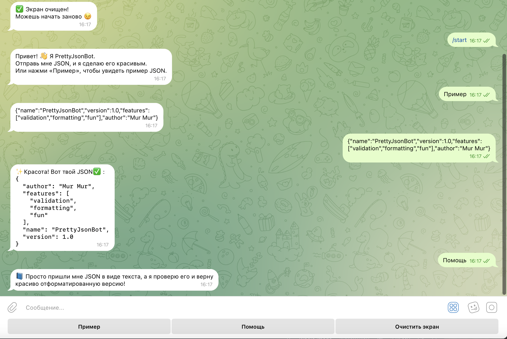
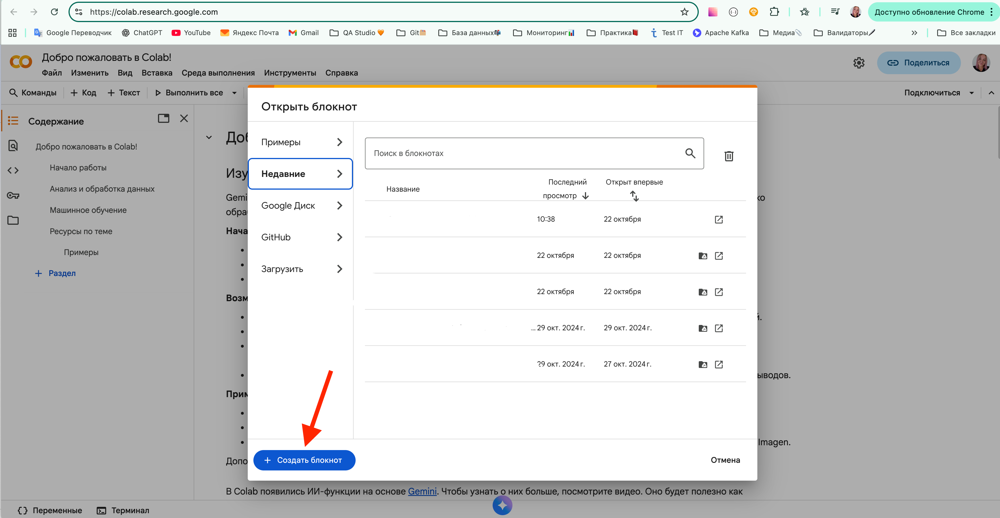
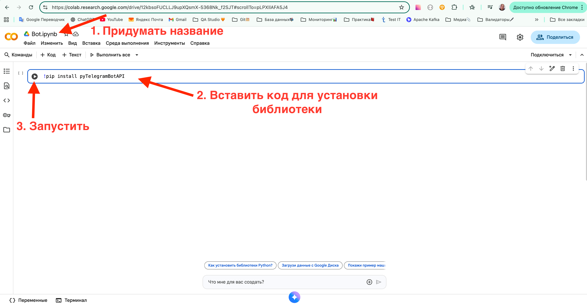
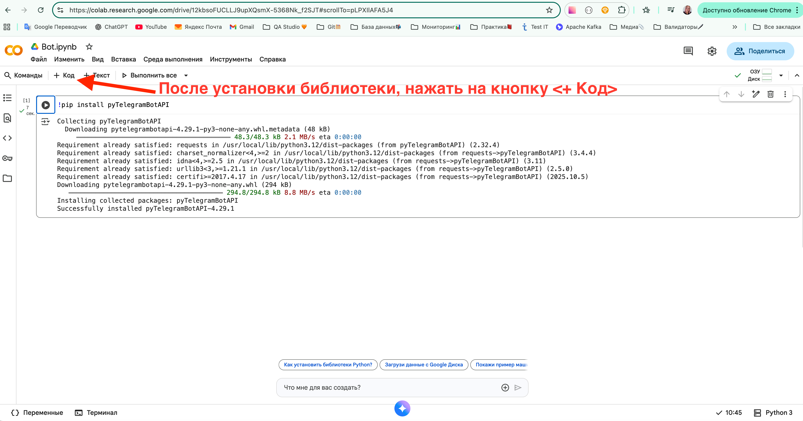
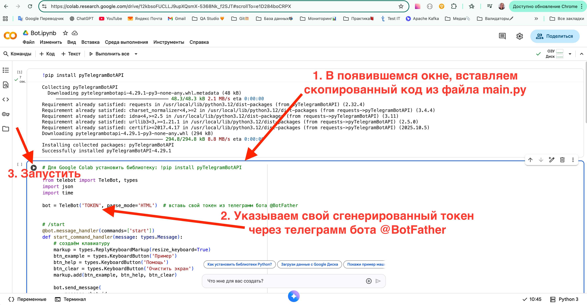

<h2>Телеграм бот с функцией валидации и бьютифаера JSON</h2>

> **Статус проекта:**
>
> 🟢 Поддерживается (активный) 

## Цели и Задачи
Помочь тестировщику, разработчику быстрее проверить JSON на нарушение синтаксиса

Этот бот при получении JSON:
* Проверяет на ошибки синтаксиса
* Возвращает JSON в удобочитаемом формате

## 🖼 Скриншоты

После отправки JSON:




## 💻 Технологии

* Python
* Библиотека `telebot`

## ⏬ Установка на локальном компьютере

1. Скачать проект
   
2. Создать бота и через [@BotFather](https://t.me/BotFather) и вставить в проекте свой токен от бота

3. Создаём виртуальное окружение внутри папки проекта.
Далее команды для MacOS (для windows инуструкция [есть вот тут](https://realpython.com/python-virtual-environments-a-primer/#create-it))

``` markdown
python3 -m venv venv
```

``` markdown
source venv/bin/activate
```
4. Устанавливаем библиотеки

``` markdown
python3 -m pip install pyTelegramBotAPI
```

5. Запускаем
   
``` markdown
python3 main.py
```

## ⏬ Установка на сервере Google Colab (30 минут)

1. Скачать проект
   
2. Создать бота, через [@BotFather](https://t.me/BotFather) 

3. Зайти на страницу https://colab.google 
   

4. Создать блокнот
   

5. Придумать название, вставить код <!pip install pyTelegramBotAPI> для установки библиотеки, запустить
   
   
6. Добавить код
   

7. Вставить код из файла main.py, не забыв указать свой токен от бота, запустить
   

8. Запустить своего бота через телеграм, работает⚒️ 
